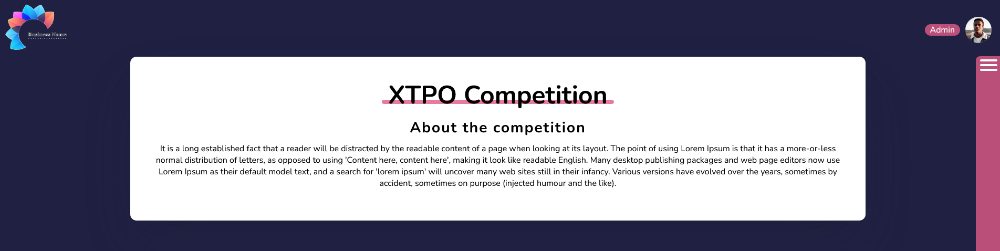

<h1 align="center">
  XTPO Competition
</h1>

  
  
  
  
  

  
  
  

  

## 💻 Project

Dummy landing page for XPTO Competition. Single-page Application created with vanilla JS, HTML & CSS.

## 🔌 Live Website Link

- [Live Website](https://xpto.brunosantos.dev/)
